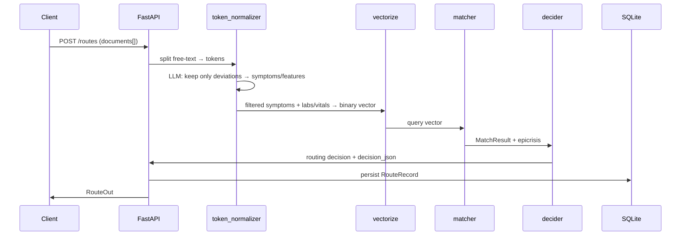
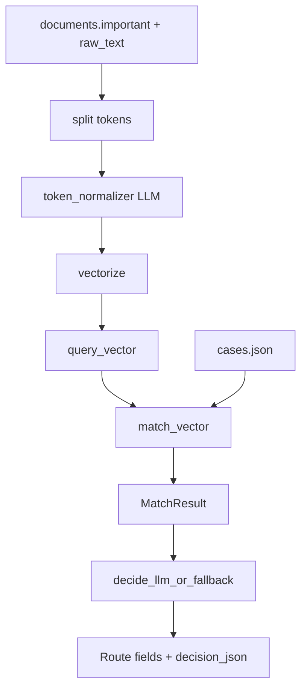

# Decider Architecture Spec

**Version:** 1.0  
**Module path:** `back/app/routing/`

## 1. Role in the pipeline



Upstream: PDF/DOCX extract + LLM structure → `documents[].important` (+ `raw_text`).  
Decider path:

1. Split free-text / structured fields into tokens.
2. **Token LLM** keeps only deviations from normal (drops «в норме», «нет», …) and maps to complaints / feature ids.
3. Builds a binary deviation vector (aliases on approved complaints; numeric labs/vitals still rule-based).
4. Finds the nearest casebook template.
5. Calls Decider LLM (or fallback) to produce the final routing JSON.

Negation / «в норме» filtering is **LLM responsibility** (`token_normalizer.py`), not regex rules.

## 2. Components

| Component | File | Responsibility |
|-----------|------|----------------|
| Feature catalog | `features.json` + `features.py` | Ordered feature ids (= vector axes), aliases, lab/vital thresholds |
| Token normalizer | `token_normalizer.py` | Split text → LLM filter deviations → symptoms + `active_features` |
| Vectorizer | `vectorize.py` | Approved tokens / important → `vector` + `active_features` |
| Casebook | `cases.json` + `cases.py` | Synthetic cases with `active_features` + golden `routing` |
| Matcher | `matcher.py` | Nearest case: max `q·c`, tie-break min `sum(c)` |
| Decider LLM | `decider.py` | Prompt + structured JSON; fallback copies case routing |
| Spec | `DECIDER_SPEC.md` | This document — code must follow it |

## 3. Data contracts

### Query vector

- Length `N = feature_dim()` (stable order from `features.json`).
- Values `{0,1}`: `1` = deviation / presence of symptom/flag.
- Accompanying `active_features: string[]` for debug/UI.

### Case record

```json
{
  "id": "case-acs-stemi-01",
  "title": "...",
  "active_features": ["symptom_chest_pain", "lab_troponin_high"],
  "routing": {
    "priority": "emergency|urgent|routine",
    "department": "string",
    "specialists": ["string"],
    "required_tests": ["string"],
    "reasoning": ["string"]
  },
  "epicrisis_snippet": "short few-shot text"
}
```

`vector` is derived at load time from `active_features`, not authored by hand.

### MatchResult

- `matched_case_id`, `match_score` (= dot product), `case_weight` (= `sum(c)`)
- `query_active`, `case_active`
- `features_version`
- `routing` (template), `epicrisis_snippet`

### Decider output (persisted on route)

```json
{
  "priority": "emergency",
  "department": "...",
  "specialists": [],
  "required_tests": [],
  "reasoning": [],
  "decision_json": {
    "matched_case_id": "...",
    "match_score": 5,
    "case_weight": 5,
    "vector_active": ["..."],
    "features_version": "1.0.0",
    "decider_model": "openrouter/...",
    "decider_source": "llm|fallback"
  }
}
```

## 4. Match algorithm

```
score(c) = sum_i q_i * c_i          # shared active features
weight(c) = sum_i c_i

choose c* = argmax score;
  among ties, argmin weight

if score(c*) == 0:
  use built-in fallback case (routine / Терапия)
```

Rationale: maximize overlap with the query; among equal overlap prefer the **sparser** template (fewer extra deviations).

## 5. Decider prompt contract

**System:** medical router; return ONLY JSON with keys  
`priority`, `department`, `specialists`, `required_tests`, `reasoning`.

**User payload includes:**

- Aggregated patient tokens / raw epicrisis excerpt.
- Nearest case id, title, `active_features`, template routing, snippet.
- Match score.

**Rules for the model:**

- Prefer adapting the matched case rather than inventing a new pathway.
- Do not invent labs that are absent from the input.
- Escalate priority if red flags / STEMI / sepsis / stroke cues are present.
- `reasoning` must cite both input markers and why the case was used.

## 6. Fallbacks and errors

| Condition | Behavior |
|-----------|----------|
| No LLM API key | Copy `case.routing`; append reasoning about fallback |
| LLM timeout / empty / invalid JSON | Same copy fallback; `decider_source=fallback` |
| `match_score == 0` | Fallback case (routine therapy) then same decide path |

Never fail the whole `POST /routes` only because LLM failed — always return a routing.

## 7. Observability

Always write into `decision_json`:

- `matched_case_id`, `match_score`, `case_weight`
- `vector_active`, `features_version`
- `text_tokens`, `token_filter` (`source`, `dropped`, filtered symptoms)
- `decider_model` (nullable), `decider_source` (`llm` | `fallback`)

Debug endpoints:

- `GET /api/v1/routing/features`
- `POST /api/v1/routing/match` — vectorize + match (+ optional LLM token filter via `normalize=true`)

## 8. Pipeline diagram (logical)



## 9. Roadmap: symptom severity (план)

Сейчас фичи бинарные (`0/1`: есть отклонение / нет). Дальше — **severityсть** у симптомов и части lab/vital, чтобы match и Decider различали «лёгкую одышку» и «тяжёлую дыхательную недостаточность».

### 9.1 Модель данных (черновик)

```json
{
  "id": "symptom_dyspnea",
  "severity": 0.0,
  "severity_label": "none|mild|moderate|severe|critical",
  "evidence": "одышка в покое"
}
```

- `severity ∈ [0, 1]` — непрерывная шкала для скоринга.
- `severity_label` — дискретная метка для UI / промпта Decider.
- Маппинг label → float (стартовый): `none=0`, `mild=0.25`, `moderate=0.5`, `severe=0.75`, `critical=1.0`.
- Labs/vitals: severity из отклонения от нормы (z-score / % выше порога), клип в `[0,1]`.

### 9.2 Где появляется

| Этап | Изменение |
|------|-----------|
| `token_normalizer` | LLM возвращает `{feature_id, severity_label, evidence}` вместо голого id; «в норме» → severity=0 / drop |
| `features.json` | Опционально `severity_hints` (ключевые слова: «лёгк*», «сильн*», «в покое», «нестерпим*») |
| `vectorize` | Вектор становится **вещественным** `list[float]` длины N (или параллельно держим binary + severity map) |
| `cases.json` | У кейсов `feature_weights` / severity-профиль вместо чистых `0/1` |
| `matcher` | Score: `sum(q_i * c_i)` уже работает для float; tie-break — близость профилей (L1) или min case mass |
| Decider | В промпт: активные фичи **с severity**; приоритет emergency при `critical` red flags |
| UI / `decision_json` | `vector_active: [{id, severity, label}]`; чипы с оттенком по тяжести |

### 9.3 Миграция без поломки

1. **Фаза A (совместимость):** binary vector как сейчас + рядом `severity_map: {feature_id: float}` в `decision_json`. Match остаётся на binary.
2. **Фаза B:** matcher переключается на weighted dot; casebook дополняется severity.
3. **Фаза C:** убрать бинаризацию там, где severity стабильна; обновить `features.meta.version`.

### 9.4 Вне скоупа сейчас

- Калибровка клинических порогов severity (нужна медвалидация).
- Обучение отдельной severity-модели — достаточно LLM + эвристики порогов.
